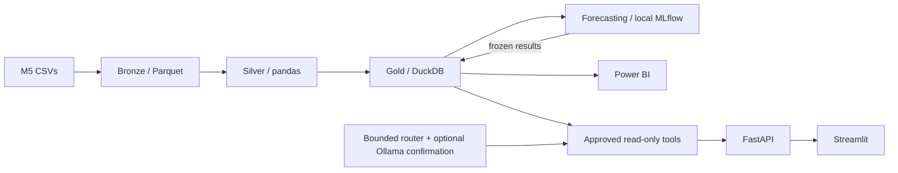

# RetailPulse AI

[](https://github.com/sjimenezch001/retailpulse-ai/actions/workflows/validate.yml)
[Resumo em português](README.pt-BR.md)

**Retail demand analytics with traceable figures and honest forecast comparisons.**
A personal portfolio project for commercial managers, BI analysts and planners who
need consistent answers about store demand, forecast error and data provenance.
It connects historical sales to one analytical source, then exposes it through
Power BI, a local web application and a bounded assistant.


Actual browser capture from the [validated bilingual UI](docs/evidence/rp10_ui_gate.md).
This is historical M5 data, not a live customer deployment.

## What it demonstrates

- Reproducible Bronze/Silver/Gold processing, quality gates and canonical SQL metrics.
- Fixed-origin forecasting, validation-only model selection and frozen backtests.
- Three Power BI pages and a FastAPI/Streamlit demo with English/Spanish and light/dark themes.
- Grounded answers with explicit period, filters, source, provider and limitations.

## Measured results

| Evidence | Result and boundary |
| --- | --- |
| [Historical M5 pilot](docs/evidence/rp09_real_acceptance.json) | **4,530,250 observed units**, across three stores and two departments; observations end 2016-05-22. |
| [Frozen test metrics](docs/model_card.md#final-one-time-test) | LightGBM **74.825958% WMAPE**, rolling mean **79.482353%**. MAE improves; RMSE worsens (**2.431177 vs 2.361194**). No measured revenue uplift. |
| [Actual local Ollama evaluation](docs/evidence/rp09_live_evaluation.json) | **36 expected outcomes passed**: **22 validated model calls**, **14 preflight outcomes**, **zero fallback**. A curated evaluation, not universal accuracy. |
| [Corrected RP-11 verification](docs/evidence/rp11/ci_corrections.json) | **254 passing tests**, **88.15%** combined line/branch coverage, **85%** enforced minimum. |
| [Post-merge CI](https://github.com/sjimenezch001/retailpulse-ai/actions/runs/37734804078) | Windows, Linux and genuine Docker build/runtime checks passed at `593dc50`. New local portfolio commits are not claimed remotely validated. |

The [claim-to-evidence index](docs/portfolio_evidence.md) links the measurements,
screenshots and caveats. [Current packaging acceptance](docs/evidence/rp13_gate.md)
separates completed checks from human and release work still pending.

## Actual architecture



The router establishes approved scope; optional local Ollama confirms the structured
selection. Tools retrieve figures and deterministic presentation renders the answer.
This is not unrestricted text-to-SQL or general-purpose conversation.
[Architecture and data grains](docs/architecture.md) distinguish pipeline writes
from read-only serving. Spark, PostgreSQL, MinIO and AWS are not deployed.

## Portable quick start

Prerequisites: Git, **Python 3.12**, and internet for installing pinned packages.
The first demo needs **no Kaggle data, Ollama, model training or Docker**.

Windows PowerShell:

```powershell
git clone https://github.com/sjimenezch001/retailpulse-ai.git
cd retailpulse-ai
py -3.12 -m venv .venv
.\.venv\Scripts\python.exe scripts/tasks.py setup
.\.venv\Scripts\python.exe -m retailpulse demo --mode synthetic --provider deterministic
```

Linux/macOS environment commands, after cloning:

```bash
python3.12 -m venv .venv
.venv/bin/python scripts/tasks.py setup
.venv/bin/python -m retailpulse demo --mode synthetic --provider deterministic
```

Open [Streamlit](http://127.0.0.1:8501) or [API docs](http://127.0.0.1:8000/docs).
Press **Ctrl+C** to stop both servers. Use `--api-port 8013 --ui-port 8513` if the
defaults are occupied. In Ask RetailPulse, ask: **How many units did SYN_A sell
during all observed dates?** Expected: **378 synthetic units**, explicitly offline.
The portable dataset and its simulated forecast comparison are not real model
performance evidence. [Mode details and troubleshooting](docs/web_demo.md).

These commands are checked in an [isolated automated reproduction](docs/evidence/rp13_gate.md#clean-environment-reproduction).
Independent verification by another person remains pending. The badge follows
published `main`; portfolio changes remain local until reviewed and authorized.

## Real-data mode and entry points

With existing local Gold, run:

```powershell
.\.venv\Scripts\python.exe -m retailpulse demo --mode real --provider deterministic
```

For a fresh real-data build, follow [M5 acquisition and license boundaries](docs/data_source.md)
and the [ordered build commands](docs/web_demo.md#real-data-build-and-entry-points).
Real inputs, populated databases and frozen model binaries are not distributed.
Missing Gold is reported explicitly; it never silently becomes synthetic data.

| Entry point | Guide |
| --- | --- |
| Power BI Desktop | [Export and prepare the local PBIP](dashboards/powerbi/BUILD_GUIDE.md); data-filled PBIX stays local |
| FastAPI | [Requests and contracts](docs/api_examples.md); `/health`, `/ready`, `/metrics/summary`, `/forecast`, `/assistant/query` |
| Assistant CLI / optional Ollama | [Examples and verified live-model activation](docs/agent_demo.md); existing `qwen2.5:1.5b` only when installed |
| Product demo | [150-second walkthrough and captions](docs/web_demo.md#150-second-product-walkthrough) |

## Engineering quality

```powershell
.\.venv\Scripts\python.exe scripts/tasks.py verify
.\.venv\Scripts\python.exe scripts/tasks.py security
.\.venv\Scripts\python.exe scripts/tasks.py build
```

Verification includes Ruff, scoped strict mypy, synthetic regressions, coverage and
dependency compatibility. Security scans fail on unknown findings. Approved tools
use parameterized SQL, read-only DuckDB, disabled external access and bounded
resources. [Security and active main ruleset](docs/security.md),
[observability](docs/observability.md), [Docker workflow](docs/developer_workflow.md#portable-container).
Docker was validated in GitHub Actions; Docker Desktop is not required locally.

## Limitations and next steps

Historical sales are not current demand or inventory; zero sales do not prove
stockouts. `revenue_proxy` is not audited revenue, missing prices remain missing,
and spikes do not establish causes. Forecast gains on this pilot do not prove
business revenue impact. The local app has no public-service authentication;
the assistant is stateless with bounded English and Spanish patterns.

RP-00 through RP-11 are implemented. **RP-12A is implemented for offline validation; AWS live acceptance is NOT RUN**.
RP-13 prepares the portfolio; independent human quick-start verification and
release approval remain explicit checkpoints. See the [release checklist](docs/release_checklist.md)
and [draft v1.0.0 notes](docs/release_notes_v1.0.0.md). Package version remains
`0.1.0`; no release or tag is published by this work. No code license is declared
yet: an owner decision is required. M5 competition-data permissions are separate.

## Optional AWS laboratory (RP-12A)

The [AWS lab](docs/aws_runbook.md) implements an isolated synthetic S3/Glue/Athena
pipeline and optional IAM-authenticated metric endpoint. Infrastructure and code
are prepared for offline validation; **AWS live acceptance is NOT RUN**.
See the [gate](docs/evidence/rp12_gate.md),
[cost controls](docs/aws_cost_controls.md) and
[disabled Redshift extension](docs/aws_redshift_extension.md).
The local demo requires no AWS account, SDK, Terraform or Spark.
