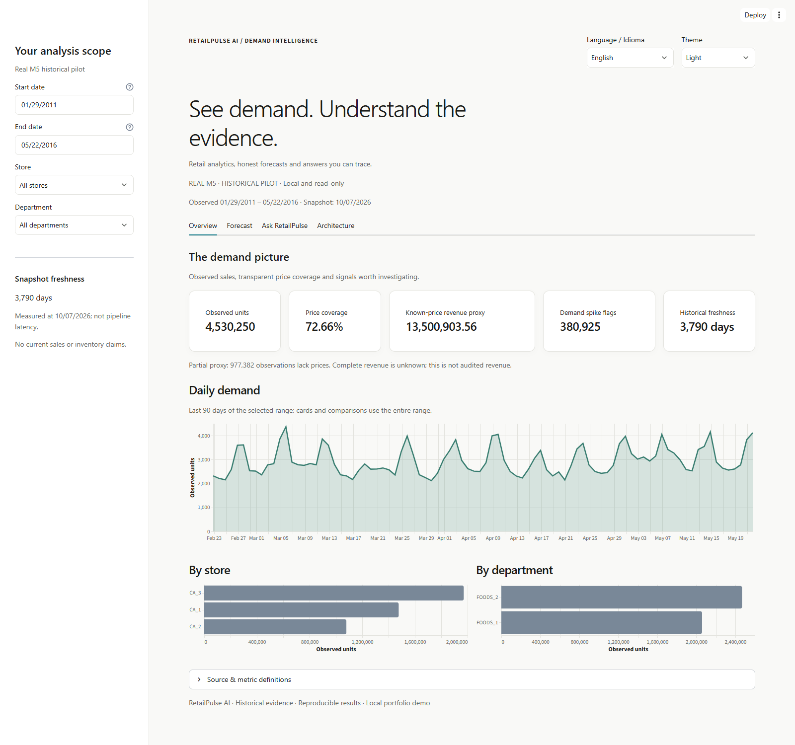

# RetailPulse AI — resumo em português

[README canônico em inglês](README.md) · [Evidências](docs/portfolio_evidence.md)

Projeto pessoal de portfólio para análise de demanda no varejo. Ajuda gestores
comerciais, analistas de BI e planejadores a consultar vendas históricas, comparar
erros de previsão e rastrear a origem das métricas. Não representa uma implantação
em cliente nem comprova ganhos financeiros.



## Resultados verificados

- **4.530.250 unidades observadas** no piloto histórico M5 de três lojas e dois
  departamentos, encerrado em 22/05/2016. [Fonte](docs/evidence/rp09_real_acceptance.json).
- LightGBM: **74,825958% de WMAPE** no teste, contra **79,482353%** da média móvel.
  O MAE melhora; o RMSE piora: **2,431177 contra 2,361194**. A seleção usou apenas
  validação. [Model card](docs/model_card.md#final-one-time-test).
- **36 resultados esperados aprovados** na avaliação local: **22 chamadas Ollama
  validadas**, **14 resultados de pré-validação**, **zero fallback**. São casos
  selecionados, não prova de precisão universal. [Avaliação](docs/evidence/rp09_live_evaluation.json).
- RP-11 corrigido: **254 testes**, **88,15% de cobertura** combinada de linhas e
  ramificações; mínimo de **85%**. [Relatório](docs/evidence/rp11/ci_corrections.json).
  Windows, Linux e Docker passaram no [CI de main](https://github.com/sjimenezch001/retailpulse-ai/actions/runs/37734804078)
  da revisão `593dc50`; novos commits locais ainda não têm CI remoto.

## Executar a demonstração portátil

Requer Git, Python 3.12 e internet para instalar os pacotes. No PowerShell:

```powershell
git clone https://github.com/sjimenezch001/retailpulse-ai.git
cd retailpulse-ai
py -3.12 -m venv .venv
.\.venv\Scripts\python.exe scripts/tasks.py setup
.\.venv\Scripts\python.exe -m retailpulse demo --mode synthetic --provider deterministic
```

Abra <http://127.0.0.1:8501>; documentação da API em <http://127.0.0.1:8000/docs>.
Ctrl+C encerra os servidores. Não requer Kaggle, Ollama, treinamento ou Docker.
Pergunte **How many units did SYN_A sell during all observed dates?**: são **378
unidades sintéticas**, com resposta determinística offline. As previsões simuladas
da demonstração não medem o desempenho real do LightGBM.

O fluxo implementado é M5 → Bronze → Silver → Gold/DuckDB → previsões/MLflow,
Power BI e ferramentas aprovadas → FastAPI → Streamlit. O roteador define o
escopo; o modelo local opcional confirma a seleção estruturada; ferramentas buscam
os números e a apresentação determinística exibe a resposta. Não há SQL livre
gerado pelo modelo. A aplicação continua em inglês/espanhol, com temas claro/escuro.

Consulte [modo real e roteiro](docs/web_demo.md), [Power BI](dashboards/powerbi/BUILD_GUIDE.md),
[assistente e Ollama](docs/agent_demo.md) e [reprodução isolada](docs/evidence/rp13_gate.md#clean-environment-reproduction).
Dados reais, bancos preenchidos, modelos e PBIX permanecem locais.

## Limites e situação

Vendas históricas não são estoque atual. `revenue_proxy` não é receita auditada;
preços ausentes não são zero. O assistente é limitado e sem contexto conversacional;
a aplicação local não oferece autenticação para hospedagem pública. A reprodução
automatizada não substitui a verificação por outra pessoa, ainda pendente.

RP-00 a RP-11 implementados; **RP-12 AWS é opcional e adiado**. O RP-13 prepara
o portfólio. A versão do pacote segue `0.1.0`; v1.0.0 tem [notas preparadas](docs/release_notes_v1.0.0.md),
sem publicação ou tag. A licença do código depende de decisão do proprietário;
permissões dos dados da competição M5 são independentes. Veja o
[checklist de lançamento](docs/release_checklist.md).
