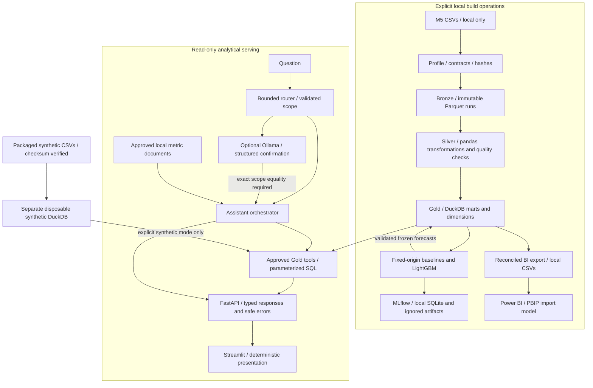
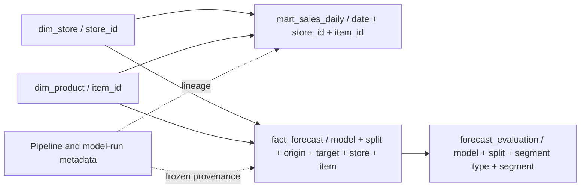

# Implemented architecture

RetailPulse AI is a local Python application. pandas and PyArrow prepare the data;
DuckDB owns analytical definitions. Power BI, approved assistant tools and the web
demo consume those definitions. LightGBM and local MLflow/SQLite implement the
frozen forecasting experiment. RP-00 through RP-11 are implemented; RP-12 AWS is
optional and deferred. No Spark, PostgreSQL, MinIO or cloud deployment is implied.

## Build time and serving time

Build commands may publish data and frozen results. Starting the demo does not
run these commands. It queries existing real Gold read-only, or loads a separate
synthetic package snapshot when explicitly requested. Missing real Gold never
triggers synthetic substitution. See [source acquisition](data_source.md),
[modeling protocol](modeling.md) and [web modes](web_demo.md).

## Compact data and model map

The diagram summarizes analytical grains, not every physical column. Sales facts
are not directly joined to forecast facts in the BI model. Power BI uses separate
daily and product-week facts and time dimensions, with dimension-to-fact filters.
WMAPE is `sum(abs(actual - predicted)) / sum(actual)`; it is not an average of
row percentages. RMSE derives from summed squared errors and observation counts.
Missing-price revenue stays explicitly partial or unknown. The
[metric catalog](metric_catalog.md), [dictionary](data_dictionary.md),
[Gold SQL](../sql/gold) and [BI model guide](../dashboards/powerbi/dashboard_spec.md)
are the detailed contracts.

## Forecasting boundary

Validation selects among three predeclared candidates. The design and final model
are frozen before the one-time test evaluation. All targets at an origin use only
history available at that origin; recursive horizons reuse predictions, not
held-out actuals. Historical LightGBM output and baseline forecasts coexist without
replacing each other. The [model card](model_card.md) records improved WMAPE/MAE
alongside worse RMSE. No future operational LightGBM service or replenishment
policy is implemented. Native models and MLflow data stay local and ignored.

## Assistant and API boundary

The deterministic router establishes supported intent and validates scope first.
Optional loopback-only Ollama confirms a closed structured selection that must
match that scope exactly. It does not create SQL, calculate the answer or expand
the supported grammar. The only tools are `get_kpi`, `get_forecast` and
`search_metric_docs`. Fixed SQL templates bind validated values as parameters.
DuckDB is read-only, external access and extension loading are disabled, and
time, memory and result sizes are bounded. Document retrieval cites a fixed local
corpus. Tools retrieve the figures; deterministic CLI/UI rendering presents them.

Preflight refusals and clarifications do not call the model. A validated selection
reports `ollama:qwen2.5:1.5b`; fallback is labeled separately and cannot count as
successful live validation. Questions are stateless. RP-10 adds bounded Spanish
normalization at the API boundary; it is not general multilingual conversation.
See [assistant safety](agent_safety.md), [orchestrator](../src/retailpulse/agent/orchestrator.py)
and [provider validation](../src/retailpulse/agent/provider.py).

FastAPI exposes `/health`, `/ready`, `/metrics/summary`, `/forecast` and
`/assistant/query`. Streamlit consumes the API; it does not calculate replacement
business metrics. The launcher owns its two servers and binds them to loopback.
Language and theme choices are session-local. Neither the application nor its
synthetic-only non-root container is an authenticated public production service.

## Engineering and evidence

Checksum-protected CSVs have explicit Git byte-preservation rules. The scanner
runs in UTF-8 on both platforms with exact reviewed exceptions. Regression,
coverage, dependency and secret checks fail closed. The
[RP-11 closure](evidence/rp11_gate.md#verified-closure--2026-10-08) links successful
Windows/Linux/Docker runs and the active main ruleset. Those remote results apply
to the recorded commits, not unpublished portfolio changes. Structured logs
contain allowlisted operational metadata, not raw questions or provider bodies.

Use the [portfolio evidence index](portfolio_evidence.md) for genuine screenshots,
measured results and the distinction between historical real data, simulated
portable forecasts and actual live-model validation.
